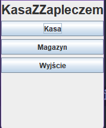
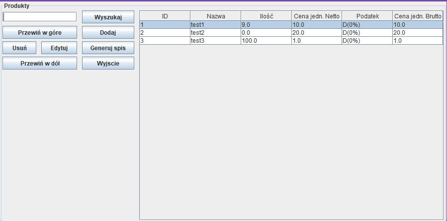
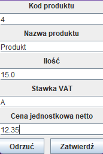
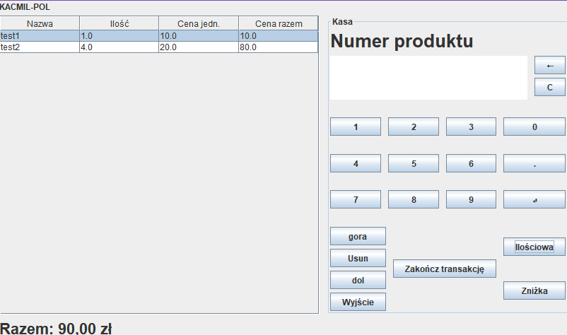

# Kasa Z Zapleczem
Kasa z zapleczem to aplikacja służąca do zarządzania sklepem. Umożliwia zarządzanie produktami, przeprowadzanie transakcji oraz generowanie raportów.
## Autorzy:
* Kacper Czura
* Kamil Ćwikła

## Funkcjonalności
- **Zarządzanie produktami**: Aplikacja umożliwia dodawanie, edycję oraz usuwanie produktów. Każdy produkt posiada unikalne ID, nazwę, cenę netto oraz stawkę VAT.
- **Wyszukiwanie produktów**: Aplikacja umożliwia wyszukiwanie produktów po nazwie.
- **Zarządzanie zapleczem**: Aplikacja umożliwia zarządzanie zapleczem sklepu, umożliwiając przeglądanie dostępnych produktów oraz ich ilości.
- **Przeprowadzanie transakcji**: Aplikacja umożliwia przeprowadzanie transakcji sprzedaży. Użytkownik może dodać produkty do koszyka, wprowadzić ilość oraz zakończyć transakcję, generując paragon.
- **Generowanie raportów**: Aplikacja umożliwia generowanie raportów w formacie arkusza inwentaryzacyjnego. Raporty są zapisywane do plików CSV.

### Uruchomienie

Aby uruchomić aplikację, należy wykonać następujące kroki:

1. Sklonowanie repozytorium
2. Otwarcie projektu w IntelliJ IDEA
3. Pobranie zależności Maven
4. Uruchomienie metody `main` w klasie `Application`, która znajduję się w pakiecie `pl.kul`.

### Struktura projektu
```
src
├───main
│   ├───java
│   │   └───pl
│   │       └───kul
│   │           │   Application.java
│   │           │
│   │           ├───facilities
│   │           │       Product.java
│   │           │       Storage.java
│   │           │       TaxRate.java
│   │           │
│   │           ├───gui
│   │           │       CashRegisterPanel.form
│   │           │       CashRegisterPanel.java
│   │           │       MainMenu.form
│   │           │       MainMenu.java
│   │           │       MenuPanel.java
│   │           │       ProductPanel.form
│   │           │       ProductPanel.java
│   │           │       StoragePanel.form
│   │           │       StoragePanel.java
│   │           │
│   │           └───tools
│   │                   FIleChooser.java
│   │                   PhysicalInventoryGenerator.java
│   │                   ReceiptGenerator.java
│   │                   StorageUtils.java
│   │
│   └───resources
└───test
    └───java
        └───pl
            └───kul
                ├───gui
                │       CashRegisterPanelTest.java
                │       MainMenuTest.java
                │       StorageAndProductPanelTest.java
                │
                └───tools
                        PhysicalInventoryGeneratorTest.java
                        StorageFileHelper.java
                        StorageUtilsTest.java
```

### Przedsawienie interfejsu użytkownika
Aplikacja posiada cztery główne panele:

**Menu główne**: Panel, który pozwala na wybór jednej z dostępnych funkcjonalności. 
<p align="center">
    
</p>

**Panel magazynu**: Panel, który pozwala na zarządzanie produktami. Umożliwia dodawanie, usuwanie oraz edycję produktów.
<p align="center">
    
</p>

**Panel produktu**: Panel, który wywoływany jest przez operacje panelu magazynu, pozwala na zarządzanie produktami. Umożliwia dodawanie, usuwanie oraz edycję produktów
<p align="center">
    
</p>

**Panel kasy fiskalnej**: Panel, który pozwala na przeprowadzanie transakcji sprzedaży. Umożliwia dodawanie produktów do koszyka, wprowadzanie ilości oraz zakończenie transakcji w tym, generowanie rachunku fiskalnego.
<p align="center">
    
</p>

### Odpowiedzialności za poszczególne funkcjonalności
**Kacper Czura**
- Stworzenie klas: `Product`, `Storage`, `TaxRate`, `PhysicalInventoryGenerator`, `StorageUtils`
- Stworzenie interfejsu użytkownika: `MainMenu`, `ProductPanel`
- Zarządzanie produktami: dodawanie/usuwanie/edycja produktów
- Zarządzanie magazynem: dodawanie/usuwanie produktów do magazynu, aktualizacja stanu magazynowego po sprzedaży, wyszukiwanie produktów, generowanie raportów
- Implementacja generatora arkusza inwentaryzacyjnego: generowanie arkusza inwentaryzacyjnego w formacie CSV, zapisywanie arkusza inwentaryzacyjnego do pliku w dowolnym miejscu na dysku
- Odczyt i zapis danych magazynowych do pliku przy starcie i zakończeniu aplikacji
- Testy jednostkowe modułów: `MainMenu`, `ProductPanel`, `StoragePanel`, `PhysicalInventoryGenerator` oraz `StorageUtils`

**Kamil Ćwikła**
- Stworzenie interfejsów użytkownika: `StoragePanel`, `CashRegisterPanel`
- Zarządzanie kasą fiskalną: implementacja interfejsu, dodawanie/usuwanie produktów do rachunku, sprzedaż ilościowa, generowanie paragonów, system obliczania reszty, aktualizacja stanu magazynowego po udanej sprzedaży, wyświetlanie odpowiednich komunikatów o błędach
- Generowanie paragonów: generowanie paragonów w formacie tekstowym, zapisywanie paragonów do pliku w dowolnym miejscu na dysku
- Implementacja klasy `FileChooser`: wybranie miejsca zapisu pliku, zapisanie pliku w wybranym miejscu
- Testy jednostkowe modułu: `CashRegisterPanel`

> [!NOTE]
> Istnieje możliwość, że historia commitów nie jest w pełni zgodna z faktycznym podziałem prac. W trakcie pracy nad projektem współpraca była realizowana za pomocą narzędzia CodeWithMe, co sprawia, że wiele zadań było realizowane wspólnie.
